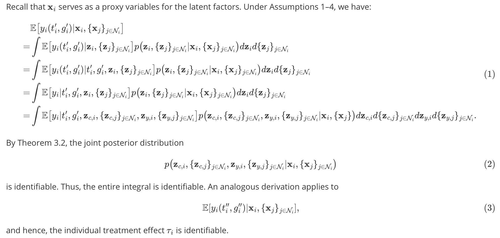
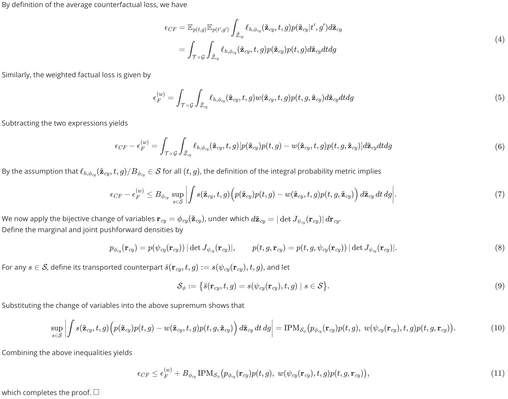
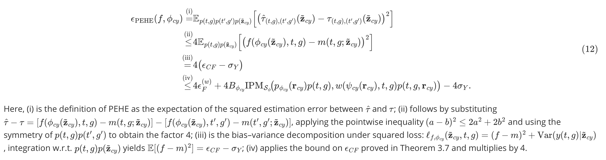
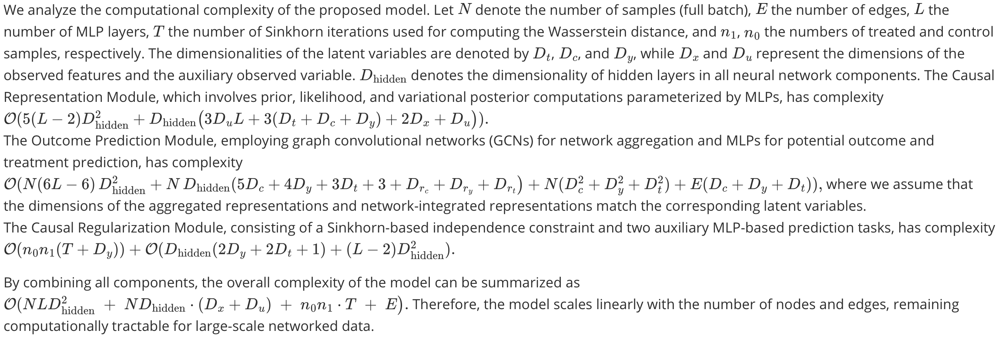

This repository implements the method presented in the paper **"Identifiable Disentangled Representation Learning for Causal Inference under Networked Interference"**.

## Contents

- **Theoretical Analysis**  
  Includes all theorem proofs from **Section 3.5** of the paper, providing a formal analysis of the identifiability of the proposed model.

- **Experimental Results**  
  Contains causal effect estimation results from **Section 4**:
  - BC(hete) dataset
  - Flickr(hete) dataset

- **Complexity Analysis**
  Summarizes the computational complexity of all core components. The full derivation and the final combined complexity expression are provided for reference.

- **Code**  
  The repository provides the full implementation in the `src` folder. The main script can be run as follows:
  ```bash
  python NDiVAE_run.py

# Theoretical Analysis

## Proof of Theorem 3.2
Follows directly from Theorem 1 in [19].

## Proof of Theorem 3.3


## Proof of Theorem 3.7


## Proof of Theorem 3.8


## Complexity analysis                         


# Experimental Results

We provide additional experimental results adn we report the results on the BC (hete) and Flickr (hete) datasets.

## Experimental results of causal effect estimation on the BC(hete) dataset.
The best result is highlighted in **bold**.
| metric              | setting        | effect | TNRNet+g              | CFR+g                 | TEDVAE+g               | NetDeconf+g           | TNDGVA+g             | NetEst                | NDiVAE_W              | NDiVAE_R              | NDiVAE                   |
|---------------------|----------------|--------|------------------------|------------------------|-------------------------|------------------------|------------------------|-------------------------|-------------------------|-------------------------|----------------------------|
| ε_average           | within sample  | AME    | 0.3394 ± 0.2801        | 0.3131 ± 0.2291        | 0.1262 ± 0.0633         | 0.3078 ± 0.3797        | 0.2404 ± 0.2065        | 1.4089 ± 2.3968         | 0.2390 ± 0.2249         | 0.2190 ± 0.1531         | **0.0566 ± 0.0402**        |
|                     |                | ASE    | 0.2852 ± 0.1070        | 0.2000 ± 0.0945        | 0.2555 ± 0.1450         | 0.1723 ± 0.1893        | 0.1185 ± 0.1370        | 0.1066 ± 0.0855         | 0.0721 ± 0.0642         | 0.0845 ± 0.0706         | **0.0813 ± 0.0502**        |
|                     |                | ATE    | 0.7193 ± 0.4339        | 0.8352 ± 0.5328        | 0.2830 ± 0.2396         | 1.5840 ± 0.6482        | 0.3406 ± 0.5736        | 1.4788 ± 2.3001         | 0.2710 ± 0.2072         | 0.2450 ± 0.1971         | **0.1040 ± 0.0815**        |
|                     | without sample | AME    | 0.4041 ± 0.3308        | 0.4306 ± 0.2502        | 0.1299 ± 0.0907         | 1.1691 ± 1.7840        | 0.3460 ± 0.2530        | 1.5159 ± 2.3055         | 0.2128 ± 0.2084         | 0.2170 ± 0.1661         | **0.0575 ± 0.0499**        |
|                     |                | ASE    | 0.2858 ± 0.1078        | 0.1999 ± 0.1091        | 0.2514 ± 0.1442         | 0.1803 ± 0.1962        | 0.1292 ± 0.1484        | 0.1083 ± 0.1071         | 0.0747 ± 0.0689         | 0.0865 ± 0.0677         | **0.0833 ± 0.0519**        |
|                     |                | ATE    | 0.6485 ± 0.4796        | 0.6994 ± 0.5723        | 0.2856 ± 0.2426         | 1.3280 ± 0.9641        | 0.4608 ± 0.7473        | 1.5487 ± 2.2548         | 0.2490 ± 0.1979         | 0.2536 ± 0.2080         | **0.1032 ± 0.0745**        |
| ε_RPEHE             | within sample  | IME    | 5.6800 ± 6.8269        | 5.2755 ± 6.9440        | **0.3858 ± 0.1382**     | 1.0588 ± 0.4738        | 1.1254 ± 1.2471        | 1.7599 ± 2.2732         | 0.4769 ± 0.1633         | 0.4695 ± 0.1330         | 0.4052 ± 0.0926           |
|                     |                | ISE    | 0.5422 ± 0.1906        | 0.5880 ± 0.1551        | 0.2977 ± 0.1346         | 0.9914 ± 0.2436        | 0.2023 ± 0.2237        | 0.4101 ± 0.2102         | 0.1192 ± 0.0820         | 0.1538 ± 0.1249         | **0.1140 ± 0.0528**        |
|                     |                | ITE    | 5.7778 ± 6.7683        | 5.4948 ± 6.8080        | 0.5051 ± 0.1581         | 1.7864 ± 0.6534        | 1.1643 ± 1.3143        | 1.7980 ± 2.2106         | 0.4880 ± 0.1568         | 0.4938 ± 0.1318         | **0.4211 ± 0.0974**        |
|                     | without sample | IME    | 6.4784 ± 5.5562        | 5.6025 ± 5.8836        | 0.3984 ± 0.1029         | 6.7882 ± 8.6845        | 1.5360 ± 1.3080        | 2.3273 ± 2.1210         | 0.4518 ± 0.1557         | 0.4800 ± 0.1256         | **0.3970 ± 0.0727**        |
|                     |                | ISE    | 0.5409 ± 0.1738        | 0.5960 ± 0.1409        | 0.2961 ± 0.1343         | 0.9801 ± 0.2048        | 0.2386 ± 0.2396        | 0.9838 ± 0.6428         | 0.1224 ± 0.0853         | 0.1549 ± 0.1175         | **0.1192 ± 0.0571**        |
|                     |                | ITE    | 6.5692 ± 5.4641        | 5.7125 ± 5.8033        | 0.4931 ± 0.1932         | 6.8951 ± 8.4949        | 1.5718 ± 1.4531        | 2.3025 ± 2.0462         | 0.4653 ± 0.1549         | 0.5049 ± 0.1272         | **0.4115 ± 0.0747**        |


## Experimental results of causal effect estimation on the Flickr(hete) dataset.
The best result is highlighted in **bold**.
| metric              | setting        | effect | TNRNet+g              | CFR+g                 | TEDVAE+g               | NetDeconf+g           | TNDGVA+g             | NetEst                | NDiVAE_W              | NDiVAE_R              | NDiVAE                   |
|---------------------|----------------|--------|------------------------|------------------------|-------------------------|------------------------|------------------------|-------------------------|-------------------------|-------------------------|----------------------------|
| ε_average           | within sample  | AME    | 0.4215 ± 0.4784        | 0.2835 ± 0.2371        | 0.1350 ± 0.0745         | 0.2250 ± 0.2672        | 0.3654 ± 0.4035        | 0.7206 ± 0.8998         | 0.2581 ± 0.1204         | 0.0830 ± 0.0659         | **0.0820 ± 0.0518**        |
|                     |                | ASE    | 0.3125 ± 0.1714        | 0.2202 ± 0.1597        | 0.1999 ± 0.1329         | 0.3962 ± 0.3039        | 0.2802 ± 0.4017        | 0.1868 ± 0.2412         | 0.0447 ± 0.0378         | 0.0479 ± 0.0176         | **0.0348 ± 0.0437**        |
|                     |                | ATE    | 0.5490 ± 0.5297        | 0.8280 ± 0.5779        | 0.1946 ± 0.2389         | 1.8472 ± 1.1642        | 0.9723 ± 1.4254        | 1.0066 ± 1.1018         | 0.2525 ± 0.1719         | **0.1246 ± 0.1021**      | 0.1248 ± 0.0701           |
|                     | without sample | AME    | 0.6421 ± 0.4148        | 0.6123 ± 0.5004        | 0.1550 ± 0.1166         | 2.9350 ± 2.1488        | 0.8872 ± 1.1460        | 1.2016 ± 0.9645         | 0.2656 ± 0.1276         | 0.1082 ± 0.0619         | **0.0988 ± 0.0627**        |
|                     |                | ASE    | 0.3101 ± 0.1816        | 0.2027 ± 0.1650        | 0.1981 ± 0.1223         | 0.3807 ± 0.3140        | 0.2673 ± 0.3813        | 0.2107 ± 0.2189         | 0.0458 ± 0.0392         | 0.0473 ± 0.0270         | **0.0405 ± 0.0475**        |
|                     |                | ATE    | 0.7437 ± 0.5093        | 0.8212 ± 0.4795        | 0.2231 ± 0.2206         | 2.7489 ± 1.9256        | 1.7171 ± 2.0745        | 1.4943 ± 1.1031         | 0.2590 ± 0.1812         | 0.1527 ± 0.1498         | **0.1448 ± 0.0863**        |
| ε_RPEHE             | within sample  | IME    | 8.0973 ± 6.6035        | 5.5882 ± 6.9011        | 0.4316 ± 0.1326         | 1.0329 ± 0.2879        | 1.7568 ± 3.3947        | 1.1825 ± 0.9137         | 0.4739 ± 0.1010         | 0.3958 ± 0.0701         | **0.3931 ± 0.0736**        |
|                     |                | ISE    | 0.5577 ± 0.2653        | 0.5188 ± 0.1991        | 0.2338 ± 0.1351         | 1.0852 ± 0.4393        | 0.5597 ± 0.7882        | 0.4386 ± 0.2757         | 0.1105 ± 0.0537         | 0.1094 ± 0.0627         | **0.0901 ± 0.0287**        |
|                     |                | ITE    | 8.1912 ± 6.4781        | 5.8033 ± 6.7600        | 0.4764 ± 0.2353         | 2.0798 ± 1.0026        | 2.2858 ± 3.5145        | 1.3884 ± 1.0943         | 0.4731 ± 0.1324         | 0.4093 ± 0.0800         | **0.4029 ± 0.0831**        |
|                     | without sample | IME    | 17.2291 ± 17.6591      | 16.2763 ± 15.8624      | 0.6807 ± 0.4335         | 15.6888 ± 14.5939      | 4.5102 ± 3.3763        | 4.5242 ± 3.5368         | 0.4947 ± 0.1102         | 0.4506 ± 0.0851         | **0.4192 ± 0.0765**        |
|                     |                | ISE    | 0.5711 ± 0.2527        | 0.5310 ± 0.1792        | 0.2403 ± 0.1228         | 1.0911 ± 0.3903        | 0.5911 ± 0.7084        | 3.6448 ± 3.1917         | 0.1152 ± 0.0528         | 0.1083 ± 0.0585         | **0.0971 ± 0.0367**        |
|                     |                | ITE    | 17.2638 ± 17.6265      | 16.3340 ± 15.8018      | 0.7184 ± 0.4726         | 15.8288 ± 14.3707      | 5.0753 ± 3.2573        | 4.8922 ± 3.9761         | 0.4902 ± 0.1374         | 0.4656 ± 0.1239         | **0.4289 ± 0.0870**        |
